# ModernNotepad 现代化记事本


现代化记事本Android应用，采用Kotlin语言开发，遵循MVVM架构模式，使用Room数据库进行本地数据持久化。

## 目录

- [功能特性](#功能特性)
- [技术栈](#技术栈)
- [项目结构](#项目结构)
- [环境要求](#环境要求)
- [构建配置](#构建配置)
- [安装与运行](#安装与运行)
- [核心组件说明](#核心组件说明)
- [界面展示](#界面展示)
- [主题支持](#主题支持)
- [扩展功能](#扩展功能)
- [许可证](#许可证)

## 功能特性

### 基础功能
(此处添加基础功能界面截图)
- ✅ 创建、编辑、删除笔记
- ✅ 笔记列表展示（支持网格和列表两种视图）
- ✅ 笔记搜索功能（按标题和内容搜索）
- ✅ 笔记分类管理
- ✅ 笔记置顶功能
- ✅ 笔记颜色标记
- ✅ 自动保存功能
- ✅ 多种编辑界面背景选择

### 高级功能
(此处添加高级功能界面截图)
- 🌙 深色/浅色主题动态切换
- 📊 笔记统计信息展示
- 🎨 彩色笔记标记系统
- 📱 响应式UI设计
- 🗂️ 多种视图模式切换
- 🔍 高级搜索和过滤功能

## 技术栈

- **语言**: Kotlin
- **架构**: MVVM (Model-View-ViewModel)
- **数据库**: Room Persistence Library
- **依赖注入**: 无（直接使用AndroidX ViewModel）
- **UI框架**: AndroidX + Material Design 3
- **构建工具**: Gradle (KTS DSL)
- **插件**: 
  - com.android.application
  - org.jetbrains.kotlin.android
  - kotlin-kapt

## 项目结构

```
app/
├── src/
│   ├── main/
│   │   ├── java/com/example/modernnotepad/
│   │   │   ├── model/          # 数据模型
│   │   │   ├── database/       # Room数据库相关
│   │   │   ├── repository/     # 数据仓库
│   │   │   ├── viewmodel/      # ViewModel层
│   │   │   ├── adapter/        # RecyclerView适配器
│   │   │   └── utils/          # 工具类
│   │   └── res/                # 资源文件
│   └── test/                   # 单元测试
└── build.gradle.kts            # 模块级构建配置
```

## 环境要求

- Android Studio Flamingo 或更高版本
- JDK 17
- Android SDK 最低版本: API 21 (Android 5.0)
- Android SDK 目标版本: API 34 (Android 14)

## 构建配置

在 `gradle.properties` 中配置了以下重要参数：

```
android.useAndroidX=true
android.nonTransitiveRClass=true
kotlin.code.style=official
org.gradle.jvmargs=-Xmx2048m -Dfile.encoding=UTF-8
```

## 安装与运行

1. 克隆项目到本地
2. 使用Android Studio打开项目
3. 等待Gradle同步完成
4. 连接Android设备或启动模拟器
5. 点击Run按钮构建并安装应用

## 核心组件说明

### Model层
- `Note`: 笔记实体类，包含标题、内容、创建时间、颜色标记、置顶状态等字段

### Database层
- `NoteDao`: Room数据访问对象，定义增删改查操作
- `NoteDatabase`: Room数据库抽象类

### Repository层
- `NoteRepository`: 数据仓库，封装数据源操作逻辑

### ViewModel层
- `NoteViewModel`: UI数据管理，处理业务逻辑

### View层
- `MainActivity`: 主界面，显示笔记列表
- `NoteEditActivity`: 笔记编辑界面
- `SettingsActivity`: 设置界面，支持主题切换

### Adapter层
- `NoteAdapter`: RecyclerView适配器，负责笔记列表的展示和交互

### Utils层
- `ThemeHelper`: 主题管理工具类

## 界面展示

### 主界面
- 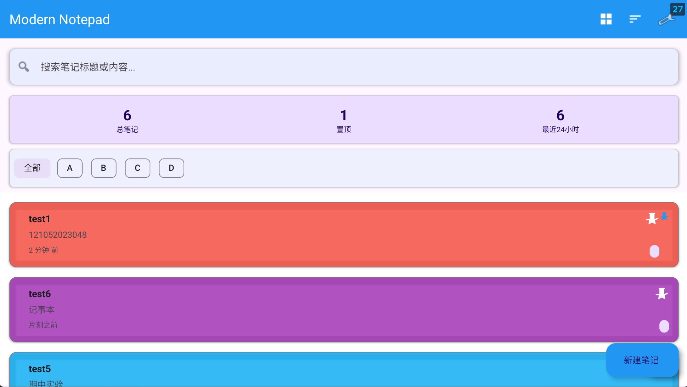
- 顶部工具栏包含搜索功能和设置入口
- 统计信息卡片显示笔记总数、置顶笔记数和最近创建笔记数
- 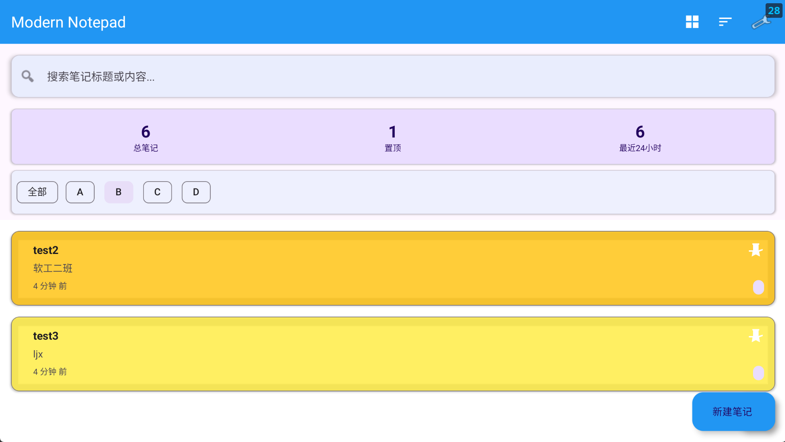
- 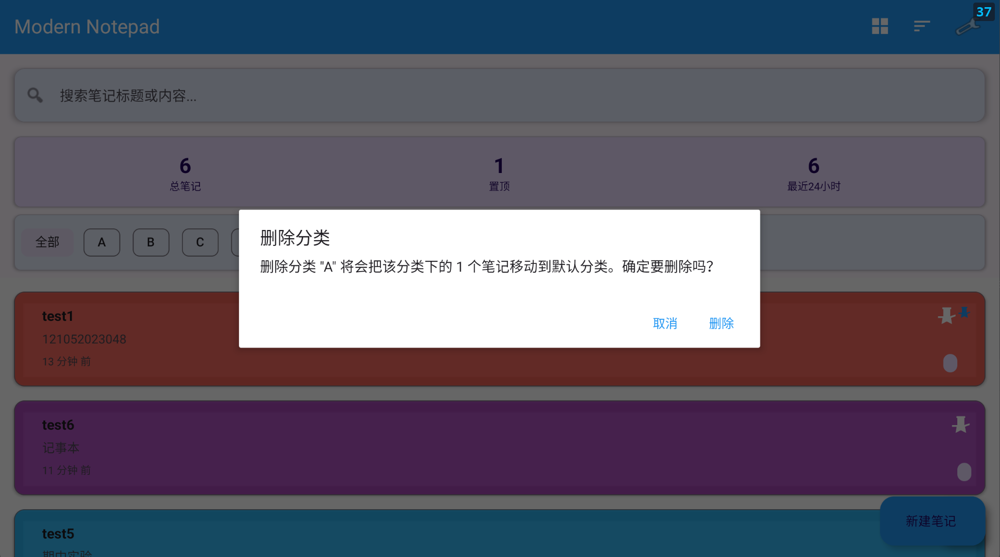
- 分类筛选栏支持按类别快速过滤笔记，支持分类删除
- 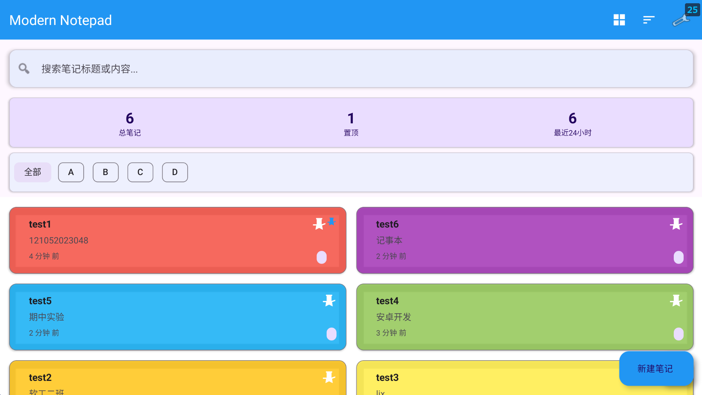
- 笔记列表支持网格和列表两种视图模式
- 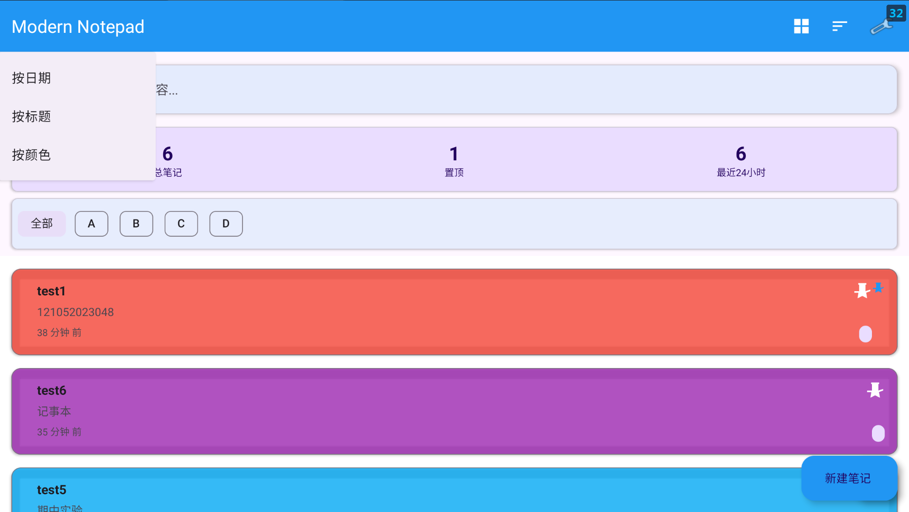
- 笔记支持按多种方式排序
- 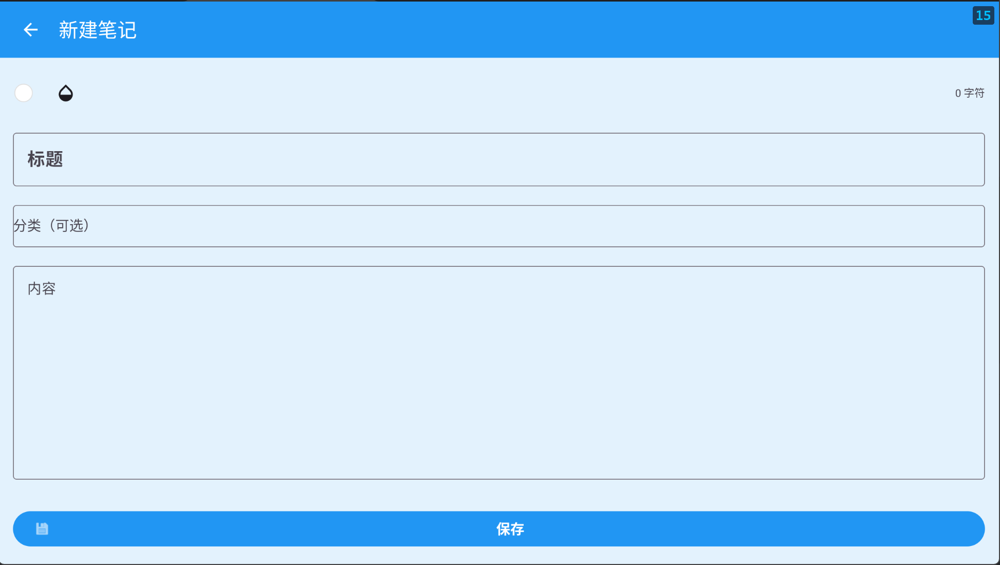
- 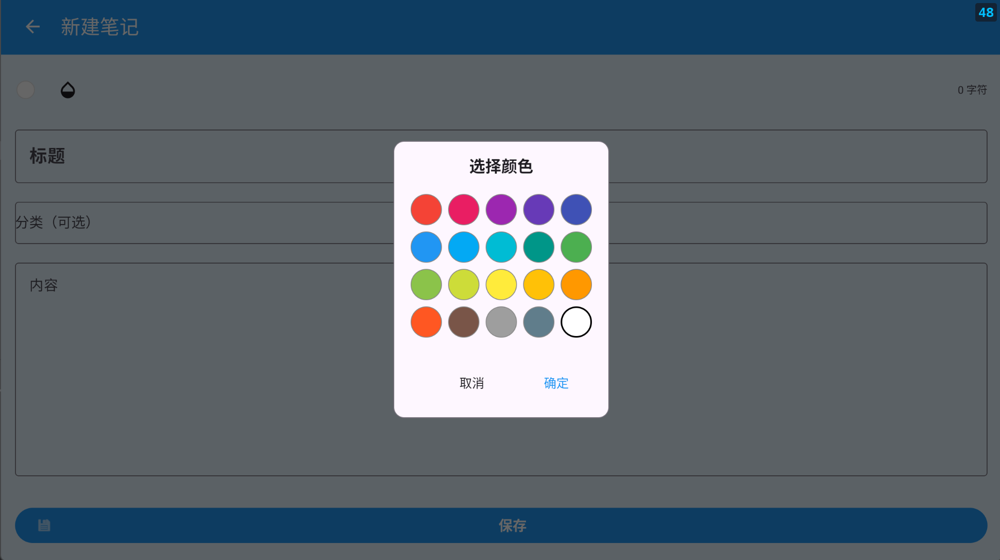
- 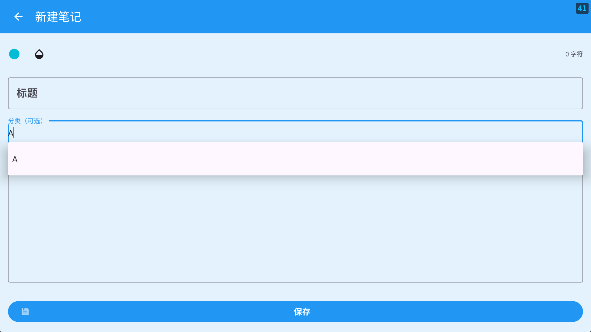
- 底部浮动操作按钮支持快速创建不同类型的笔记

### 编辑界面
- 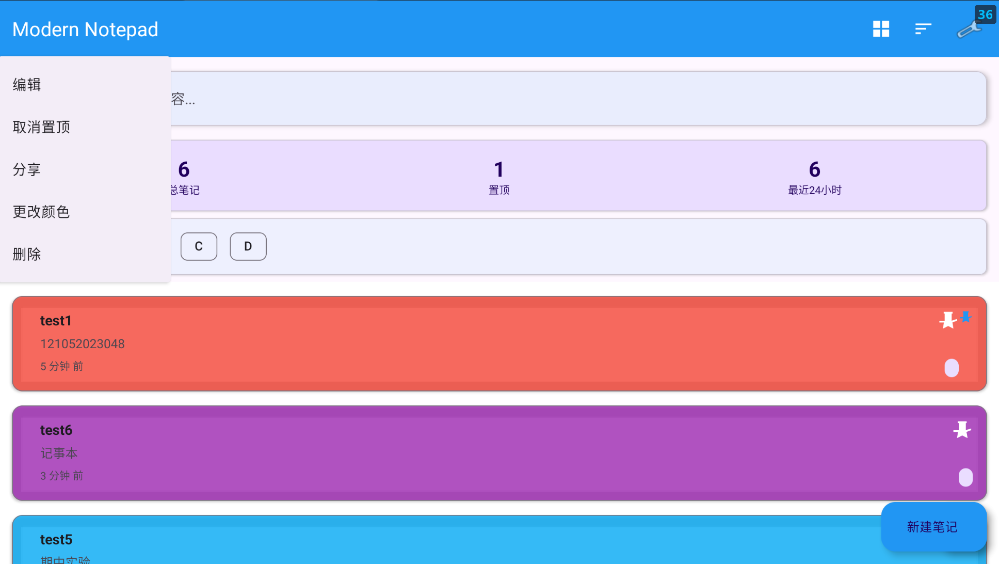
- 顶部工具栏包含保存、删除、分享等功能
- 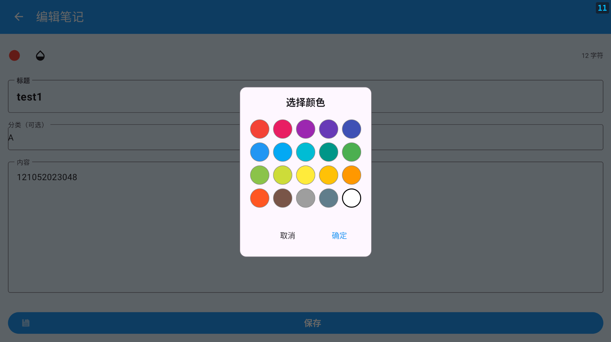
- 标题输入框
- 内容编辑区域
- 颜色标记选择器
- 
- 置顶开关
- 
- 分类标签输入

### 设置界面
- 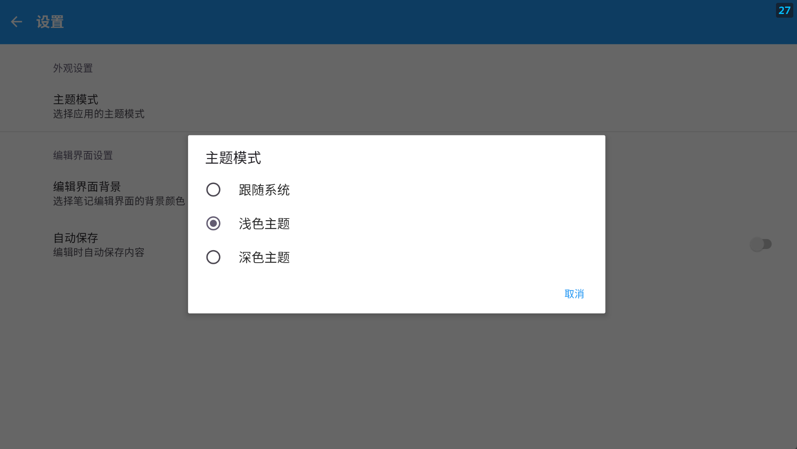
- 主题模式选择（跟随系统/浅色/深色）
- 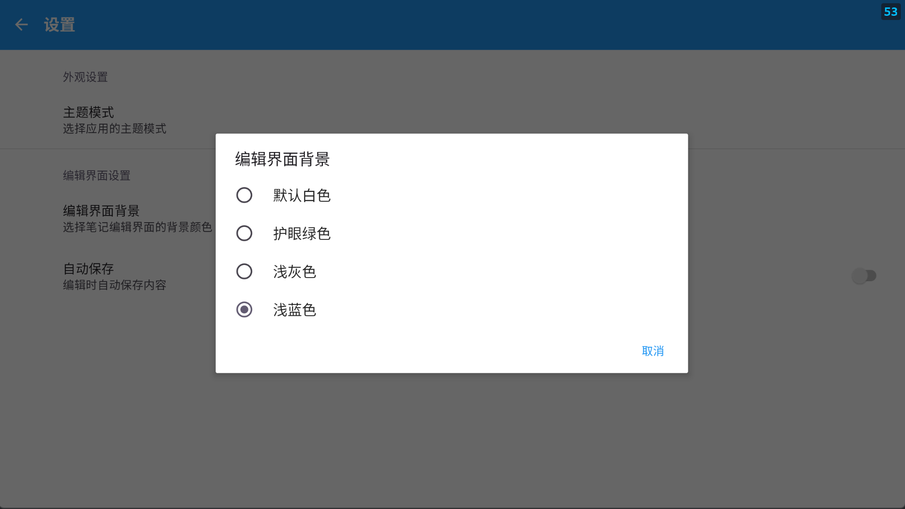
- 编辑界面背景选择
- 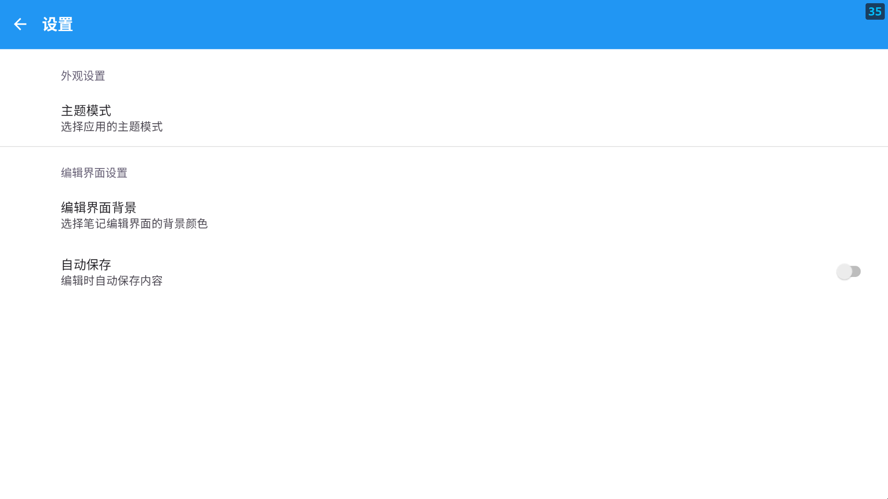
- 自动保存开关

## 主题支持
- 
- 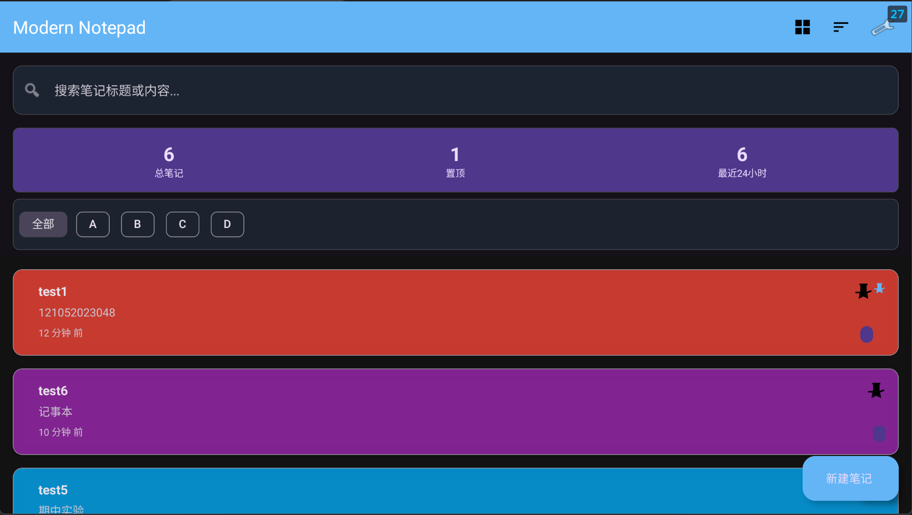
- 
- 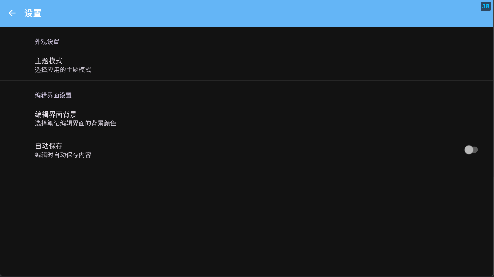
- 
- 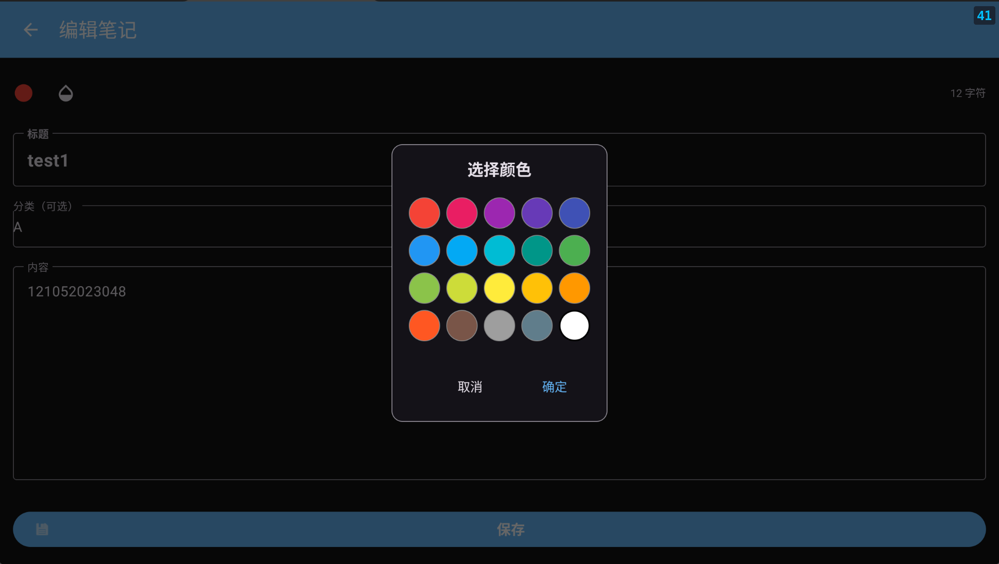
应用现在支持深色和浅色主题模式的动态切换。用户可以在设置界面选择以下主题选项：
- 跟随系统：根据系统设置自动切换深色/浅色主题
- 浅色主题：始终使用浅色主题
- 深色主题：始终使用深色主题

主题切换功能会立即生效，无需重启应用。

实现细节：
- 使用`AppCompatDelegate.setDefaultNightMode()`方法控制主题模式
- 通过SharedPreferences保存和读取用户主题偏好
- 使用SharedPreferenceChangeListener实时监听主题变化并重新创建Activity以应用新主题
- 在Activity生命周期中正确注册和注销监听器以避免内存泄漏
- 为深色主题定制了专门的颜色资源，确保界面在深色模式下也有良好的视觉效果

## 扩展功能

### 1. 多种编辑背景
用户可以选择不同的编辑界面背景颜色：
- 默认白色背景
- 护眼绿色背景
- 浅灰色背景
- 浅蓝色背景

### 2. 彩色笔记系统
支持为笔记添加颜色标记，便于分类和识别：
- 红色、粉色、紫色等多种颜色选择
- 颜色指示器在列表中直观显示

### 3. 笔记置顶
重要笔记可以置顶显示，方便快速访问。

### 4. 多视图模式
支持列表和网格两种视图模式切换，满足不同用户的使用习惯。

### 5. 统计信息
主界面显示笔记统计信息，包括总数、置顶数和最近创建数。

### 6. 快速笔记创建
支持多种方式快速创建笔记：
- 普通笔记
- 彩色笔记
- 快速笔记（直接进入编辑界面）

## 许可证

MIT License

Copyright (c) 2025 ModernNotepad

Permission is hereby granted, free of charge, to any person obtaining a copy
of this software and associated documentation files (the "Software"), to deal
in the Software without restriction, including without limitation the rights
to use, copy, modify, merge, publish, distribute, sublicense, and/or sell
copies of the Software, and to permit persons to whom the Software is
furnished to do so, subject to the following conditions:

The above copyright notice and this permission notice shall be included in all
copies or substantial portions of the Software.

THE SOFTWARE IS PROVIDED "AS IS", WITHOUT WARRANTY OF ANY KIND, EXPRESS OR
IMPLIED, INCLUDING BUT NOT LIMITED TO THE WARRANTIES OF MERCHANTABILITY,
FITNESS FOR A PARTICULAR PURPOSE AND NONINFRINGEMENT. IN NO EVENT SHALL THE
AUTHORS OR COPYRIGHT HOLDERS BE LIABLE FOR ANY CLAIM, DAMAGES OR OTHER
LIABILITY, WHETHER IN AN ACTION OF CONTRACT, TORT OR OTHERWISE, ARISING FROM,
OUT OF OR IN CONNECTION WITH THE SOFTWARE OR THE USE OR OTHER DEALINGS IN THE
SOFTWARE.